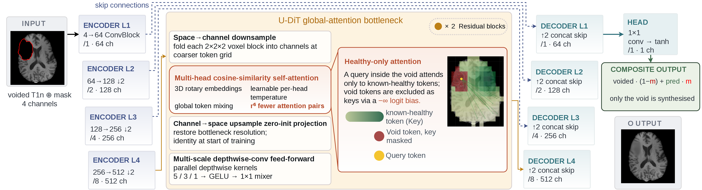

# Now You Have My Healthy Attention: A U-DiT for Brain-MRI Inpainting

Code for our submission to the ASNR-MICCAI **BraTS-2026 Local Synthesis (Inpainting)** task, which asks for the anatomically plausible completion of healthy brain tissue inside a masked region of a T1-weighted MRI.

The task is scored by distortion metrics (SSIM, PSNR, MSE) over the *healthy* sub-region of the mask.



## Architecture

A 3D convolutional encoder-decoder whose bottleneck holds a single **U-DiT global-attention block**: self-attention runs on a token grid downsampled by `r = 2`, so it mixes tokens globally at `r^6 = 64x` fewer attention pairs, while the surrounding convolutions and skip connections keep the high-frequency detail.

Three task-specific techniques sit on top:

- **Healthy-only attention.** The mask is average-pooled onto the coarse token grid and every predominantly-void key receives a "-inf" logit bias, so a query inside the void attends *only* to known-healthy tokens of the same volume, reaching non-locally across both hemispheres.
- **Contralateral-symmetry input.** Two extra input channels: the left-right mirror of the voided volume about the estimated mid-sagittal plane, plus a validity map that discounts mirror voxels falling outside the brain or inside the void.
- **Contralateral-attention**. A third, mechanism (`--contra_attn`) adds a learned, zero-initialised bias on the attention logits peaked at the query's mirror position.

---
Three architectures share the same training and inference code, selected with `--arch`:

| `--arch` | model | notes |
| --- | --- | --- |
| `udit` | **U-DiT** (Best) | full-resolution convolutional hierarchy, U-DiT bottleneck |
| `wudit` | **WaveUDiT** | same backbone on a 3D Haar wavelet decomposition: 8x fewer spatial positions |
| `whdit2d` | **WaveHUDiT** | wavelet domain with a hierarchical hourglass transformer bottleneck |

## Results

Scored with the **official** metric on the native volume over our held-out validation split (60 cases), preset `crop_only`. `rank` is the per-case rank sum with MSE weighted twice, because the official PSNR takes its `data_range` from the ground truth alone and its per-case rank is therefore exactly the inverse MSE rank; lower is better.

| model | SSIM | PSNR | MSE | rank |
| --- | --- | --- | --- | --- |
| **U-DiT** | **0.8790** | **23.703** | **0.004380** | **1.117** |
| WaveUDiT | 0.8703 | 23.087 | 0.004800 | 1.883 |
| WaveHUDiT | 0.7812 | 17.881 | 0.014233 | 3.000 |

The wavelet variants are cheaper to run (8x less activations).


## Install

```bash
conda create -n waveudit python=3.11 && conda activate waveudit
pip install -r requirements.txt
```

`requirements.txt` covers the U-DiT and WaveUDiT paths. The **WaveHUDiT** variant additionally needs `natten` and `dctorch` for the hourglass transformer; install them only if you want `--arch whdit2d`:

```bash
pip install dctorch natten
```

## Data

Download the BraTS-2026 Local Synthesis data (registration required) and point the code at it. Every entrypoint reads these:

```bash
export BRATS_DATA=/path/to/ASNR-MICCAI-BraTS2023-Local-Synthesis-Challenge-Training
export BRATS_CACHE=/path/to/cache        # optional, defaults to ./cache/inpaint
export BRATS_VAL=/path/to/...-Validation # only for gen_val_predictions.py
```

Each case directory holds `<case>-t1n.nii.gz` (ground truth), `<case>-t1n-voided.nii.gz`, `<case>-mask.nii.gz` and `<case>-mask-healthy.nii.gz`. Intensities are normalised by the per-volume maximum **of the voided image**, which is the convention available at inference time, then rescaled to `[-1, 1]`. The first pass caches the preprocessed volumes, so it is slower than later ones.

## Training

`scripts/launch_udit_clean.sh` wraps `train.py` with the exact configuration of the submitted model, healthy-only attention and contralateral weighting included. It reads `GPU`, `BASE`, `EPOCHS`, `BATCH`, `LR` and `INIT` from the environment.

```bash
# U-DiT, the submitted model
GPU=0 bash scripts/launch_udit_clean.sh

# warm-start from an existing checkpoint instead of from scratch
GPU=0 INIT=/abs/path/to/checkpoint.pth bash scripts/launch_udit_clean.sh
```

One invocation runs **one** cosine cycle of 25 epochs. The reported model is a chain of three
warm-started cycles, roughly 100 epochs in total: 50 at `lr 1e-4`, then 25 at `1e-4`, then 25 at
`5e-5`, each starting from the best checkpoint of the previous cycle with the schedule restarted
(`--init_from` loads weights only, not optimiser state). Halving the learning rate for the last
cycle matters: at the full `1e-4` the first step moves far enough to undo a good optimum, and the
run spends most of the cycle recovering it. Pick the checkpoint each cycle starts from with
`scripts/pick_best_aligned.py`, not by filename.

Or call the entrypoint directly. The wavelet variants are the same command with `--arch wudit` or `--arch whdit2d`; `wudit` also wants `--udit_downsample 1`, because the wavelet bottleneck grid is odd and cannot be halved again.

```bash
CUDA_VISIBLE_DEVICES=0 PYTHONPATH=. python scripts/train.py \
  --arch udit --base 64 --levels 4 --dropout 0.2 \
  --udit_downsample 2 --udit_d_head 64 --udit_blocks 2 --sharpen_head --udit_tokenrep \
  --nonlocal_healthy --in_contra \
  --l2_weight 10.0 --healthy_loss_alpha 0.25 --channels_last --tf32 \
  --hf_weight 0.5 --aug_on_gpu --crop_in_dataset --in_ram \
  --data_root "$BRATS_DATA" --cache_dir "$BRATS_CACHE" \
  --target_shape 160 256 256 --crop_size 144 208 208 \
  --random_mask_prob 1.0 --masks_per_case 8 \
  --ssim_mode masked --mae_plain --eval_healthy --select_on mean \
  --batch_size 2 --grad_accum 1 --lr 1e-4 --lr_min 1e-7 --warmup_steps 300 \
  --epochs 25 --ema_decay 0.995 \
  --checkpoint_dir runs/udit --run_name udit
```


## Inference

`container/predict.py` is the submission entrypoint and works standalone. It reads a directory of cases and writes `<case>-t1n-inference.nii.gz`, compositing the known tissue back unchanged so only the void is synthesised.

```bash
CUDA_VISIBLE_DEVICES=0 PYTHONPATH=. python container/predict.py \
  --input-dir /path/to/cases --output-dir /path/to/out \
  --ckpt /path/to/model.pth
```

The input directory is searched recursively for `*-t1n-voided.nii.gz` with a sibling `*-mask.nii.gz`; the ground truth is never read. The architecture is rebuilt from the `config` dict stored inside the checkpoint, so one entrypoint serves all three variants.


## Evaluation and checkpoint selection

`select_final_model.py` runs the real submission pipeline per candidate and ranks them the way the challenge does, on native geometry:

```bash
MODELS="a:/abs/a.pth,b:/abs/b.pth" PRESET=crop_only NCASES=60 \
  CUDA_VISIBLE_DEVICES=0 PYTHONPATH=. python scripts/select_final_model.py
```

Training-time validation scores the *padded* volume on axial slices, whereas the challenge scores native geometry on sagittal slices; and selecting on SSIM alone ignores that most of the score is squared error. `pick_best_aligned.py` re-scores the checkpoints a run saved with the objective-aligned criterion `ssim/0.090 - 2*mse/0.00362`, instead of trusting a filename. `snapshot_bests.sh` polls a run directory and keeps every distinct best checkpoint, since the trainer overwrites its two best files in place.

## Docker

The container is what the challenge actually runs. Insert a checkpoint into `container/model/model.pth`, then:

```bash
cd container && docker build -t udit-inpaint:v1 .

docker run --rm --gpus '"device=0"' --network none \
  -v /path/to/input:/input:ro -v /path/to/output:/output \
  udit-inpaint:v1 --input-dir /input --output-dir /output
```

Network access is disabled during evaluation, so every dependency is installed at build time and the weights are loaded in.

## Ablations

Cumulative, on our internal validation split:

| configuration | SSIM | PSNR | MSE |
| --- | --- | --- | --- |
| full transformer backbone | 0.580 | - | - |
| U-DiT backbone | 0.848 | 21.5 | 0.0053 |
| + healthy-only attention | 0.853 | 21.9 | 0.0049 |
| + contralateral input | 0.856 | 22.1 | 0.0047 |
| + TTA and annealing | 0.865 | 22.5 | 0.0044 |


## Citation

```bibtex
TO BE UPDATED
```

## Acknowledgements

Built on the BraTS Local Synthesis benchmark. The U-DiT downsampled-attention primitive follows Tian et al.; the hourglass transformer used by the WaveHUDiT variant follows Crowson et al.

## License

MIT, see [LICENSE](LICENSE).
